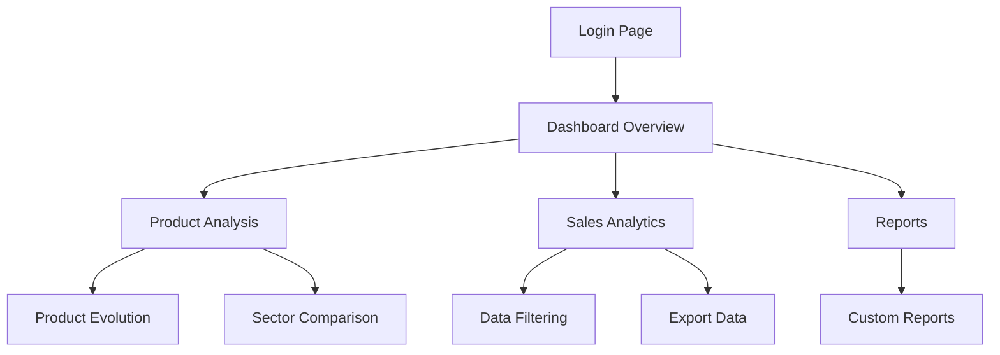

## 1. Product Overview
A comprehensive sales data analysis dashboard that transforms raw sales data into actionable business insights. The dashboard analyzes sales performance across multiple dimensions including products, sectors, consumer types, and time periods.

**Target Users:** Sales managers, business analysts, and executives who need to monitor sales performance, identify trends, and make data-driven decisions.

**Market Value:** Enables businesses to optimize sales strategies, track product performance, and improve revenue through data-driven insights.

## 2. Core Features

### 2.1 User Roles
| Role | Registration Method | Core Permissions |
|------|---------------------|------------------|
| Sales Manager | Email registration | Full dashboard access, export data, configure KPIs |
| Business Analyst | Email registration | View analytics, create custom reports, filter data |
| Executive | Invitation-based | View high-level metrics, executive summaries |

### 2.2 Feature Module
Our sales dashboard consists of the following main pages:
1. **Dashboard Overview**: KPI cards, sales trends chart, top performing products
2. **Product Analysis**: Product performance metrics, evolution tracking, sector comparison
3. **Sales Analytics**: Detailed sales data table with filtering and sorting
4. **Reports**: Exportable reports and custom analytics views

### 2.3 Page Details
| Page Name | Module Name | Feature description |
|-----------|-------------|---------------------|
| Dashboard Overview | KPI Cards | Display total revenue, units sold, average price, growth percentage |
| Dashboard Overview | Sales Trend Chart | Line chart showing revenue trends over time with period selection |
| Dashboard Overview | Top Products | Bar chart displaying top 10 products by revenue |
| Dashboard Overview | Sector Performance | Pie chart showing revenue distribution by product sector |
| Product Analysis | Product Evolution | Track product performance over time with trend indicators |
| Product Analysis | Sector Comparison | Compare performance across different product sectors |
| Product Analysis | Product Details | Show individual product metrics including quantity, revenue, margins |
| Sales Analytics | Data Table | Display all sales records with complete column data |
| Sales Analytics | Advanced Filtering | Filter by date range, product, sector, consumer type, unit |
| Sales Analytics | Sorting | Sort by any column ascending/descending |
| Sales Analytics | Search | Search products by name or code |
| Reports | Export Data | Export filtered data to CSV/Excel format |
| Reports | Custom Reports | Create and save custom report configurations |
| Login | Authentication | Secure login with email and password |

## 3. Core Process
**Sales Manager Flow:**
1. Login to dashboard
2. View KPI overview on main dashboard
3. Analyze sales trends and identify patterns
4. Drill down into product performance
5. Filter data for specific time periods or products
6. Export reports for presentations

**Business Analyst Flow:**
1. Access detailed sales data table
2. Apply advanced filters for analysis
3. Create custom views and reports
4. Compare performance across sectors
5. Track product evolution over time

## 4. User Interface Design

### 4.1 Design Style
- **Primary Colors:** Blue (#2563eb) for primary actions, Green (#10b981) for positive metrics
- **Secondary Colors:** Gray (#6b7280) for secondary text, Red (#ef4444) for negative trends
- **Button Style:** Rounded corners with subtle shadows, hover effects
- **Typography:** Inter font family, 14px base size, clear hierarchy
- **Layout:** Card-based design with consistent spacing, top navigation bar
- **Icons:** Feather icons for consistency, emoji for KPI cards

### 4.2 Page Design Overview
| Page Name | Module Name | UI Elements |
|-----------|-------------|-------------|
| Dashboard Overview | KPI Cards | Large numbers with trend indicators, emoji icons, responsive grid layout |
| Dashboard Overview | Charts | Recharts library, interactive tooltips, legend positioning, color-coded data |
| Sales Analytics | Data Table | Virtualized rows, sticky headers, sort indicators, pagination controls |
| Product Analysis | Evolution Chart | Time-series line chart with multiple product comparison |
| Filtering | Filter Bar | Date pickers, multi-select dropdowns, clear filters button |

### 4.3 Responsiveness
- **Desktop-first** design with mobile adaptation
- **Breakpoints:** 640px (mobile), 768px (tablet), 1024px (desktop)
- **Touch optimization** for tablet users
- **Collapsible navigation** for mobile devices
- **Responsive charts** that adapt to screen size