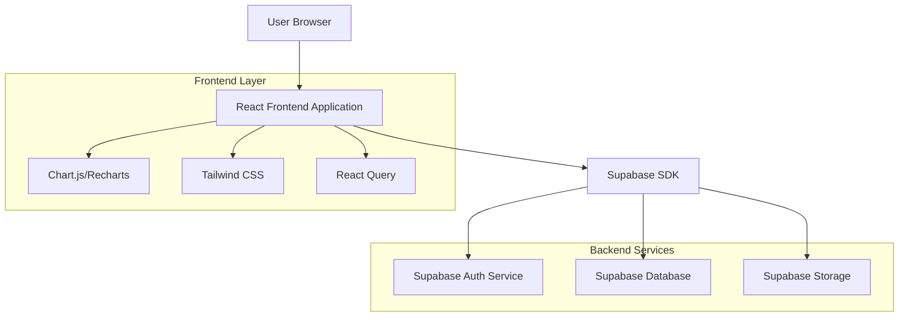
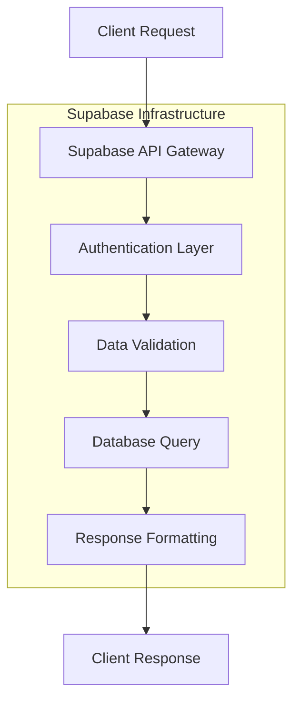
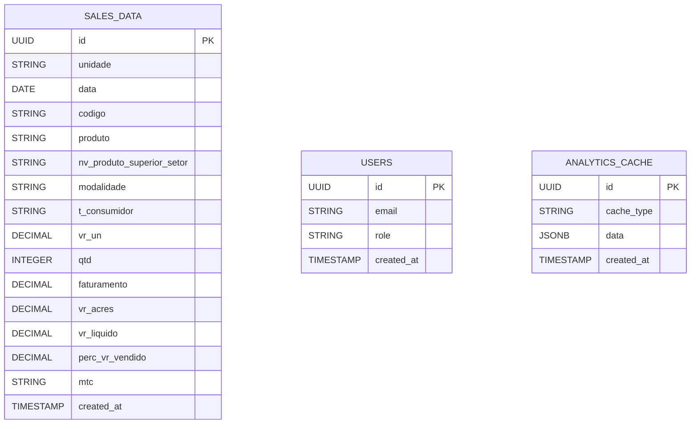

## 1. Architecture Design



## 2. Technology Description

* **Frontend:** React\@18 + TypeScript\@5 + Tailwind CSS\@3 + Vite

* **Data Visualization:** Recharts\@2 + Chart.js\@4

* **State Management:** React Query\@5 + Context API

* **Backend:** Supabase (PostgreSQL + Auth + Storage)

* **UI Components:** Headless UI + Custom Components

* **Date Handling:** date-fns\@2

## 3. Route Definitions

| Route      | Purpose                                      |
| ---------- | -------------------------------------------- |
| /          | Dashboard overview with KPIs and main charts |
| /login     | User authentication page                     |
| /products  | Product analysis and evolution tracking      |
| /analytics | Detailed sales data table with filtering     |
| /reports   | Export and custom report generation          |
| /profile   | User profile and settings                    |

## 4. API Definitions

### 4.1 Authentication APIs

```
POST /auth/v1/token
```

Request:

```json
{
  "email": "user@example.com",
  "password": "securepassword"
}
```

### 4.2 Sales Data APIs

```
GET /rest/v1/sales_data
```

Query Parameters:

| Param Name    | Param Type | isRequired | Description              |
| ------------- | ---------- | ---------- | ------------------------ |
| date\_from    | string     | false      | Start date (YYYY-MM-DD)  |
| date\_to      | string     | false      | End date (YYYY-MM-DD)    |
| product\_code | string     | false      | Filter by product code   |
| sector        | string     | false      | Filter by product sector |
| unit          | string     | false      | Filter by business unit  |

Response:

```json
{
  "data": [
    {
      "id": "uuid",
      "unidade": "string",
      "data": "2024-01-15",
      "codigo": "PROD001",
      "produto": "Product Name",
      "nv_produto_superior_setor": "Sector Name",
      "modalidade": "Sales Type",
      "t_consumidor": "Consumer Type",
      "vr_un": 99.99,
      "qtd": 100,
      "faturamento": 9999.99,
      "vr_acres": 0.00,
      "vr_liquido": 9999.99,
      "perc_vr_vendido": 85.5,
      "mtc": "MTC Code",
      "created_at": "2024-01-15T10:00:00Z"
    }
  ],
  "count": 1000,
  "error": null
}
```

### 4.3 Analytics APIs

```
GET /rest/v1/analytics/kpi
```

Response:

```json
{
  "total_revenue": 150000.00,
  "total_units": 2500,
  "average_price": 60.00,
  "growth_percentage": 15.5,
  "top_products": [...],
  "sector_distribution": [...]
}
```

## 5. Server Architecture Diagram



## 6. Data Model

### 6.1 Database Schema



### 6.2 Data Definition Language

**Sales Data Table**

```sql
-- Create sales_data table
CREATE TABLE sales_data (
    id UUID PRIMARY KEY DEFAULT gen_random_uuid(),
    unidade VARCHAR(100) NOT NULL,
    data DATE NOT NULL,
    codigo VARCHAR(50) NOT NULL,
    produto VARCHAR(255) NOT NULL,
    nv_produto_superior_setor VARCHAR(100),
    modalidade VARCHAR(50),
    t_consumidor VARCHAR(50),
    vr_un DECIMAL(10,2) NOT NULL,
    qtd INTEGER NOT NULL,
    faturamento DECIMAL(12,2) NOT NULL,
    vr_acres DECIMAL(10,2) DEFAULT 0.00,
    vr_liquido DECIMAL(12,2) NOT NULL,
    perc_vr_vendido DECIMAL(5,2),
    mtc VARCHAR(20),
    created_at TIMESTAMP WITH TIME ZONE DEFAULT NOW()
);

-- Create indexes for performance
CREATE INDEX idx_sales_data_date ON sales_data(data);
CREATE INDEX idx_sales_data_codigo ON sales_data(codigo);
CREATE INDEX idx_sales_data_setor ON sales_data(nv_produto_superior_setor);
CREATE INDEX idx_sales_data_unidade ON sales_data(unidade);

-- Grant permissions
GRANT SELECT ON sales_data TO anon;
GRANT ALL PRIVILEGES ON sales_data TO authenticated;
```

**Users Table**

```sql
-- Create users table for role management
CREATE TABLE users (
    id UUID PRIMARY KEY DEFAULT gen_random_uuid(),
    email VARCHAR(255) UNIQUE NOT NULL,
    role VARCHAR(50) DEFAULT 'analyst' CHECK (role IN ('admin', 'manager', 'analyst', 'executive')),
    created_at TIMESTAMP WITH TIME ZONE DEFAULT NOW()
);

-- Grant permissions
GRANT SELECT ON users TO anon;
GRANT ALL PRIVILEGES ON users TO authenticated;
```

## 7. Component Structure

### 7.1 Main Components

```
src/
├── components/
│   ├── Dashboard/
│   │   ├── KPICard.tsx
│   │   ├── SalesTrendChart.tsx
│   │   ├── TopProductsChart.tsx
│   │   └── SectorDistribution.tsx
│   ├── ProductAnalysis/
│   │   ├── ProductEvolution.tsx
│   │   ├── SectorComparison.tsx
│   │   └── ProductDetails.tsx
│   ├── SalesAnalytics/
│   │   ├── DataTable.tsx
│   │   ├── FilterBar.tsx
│   │   └── ExportButton.tsx
│   └── Common/
│       ├── Layout.tsx
│       ├── Header.tsx
│       └── LoadingSpinner.tsx
├── hooks/
│   ├── useSalesData.ts
│   ├── useAnalytics.ts
│   └── useAuth.ts
├── utils/
│   ├── formatters.ts
│   ├── calculations.ts
│   └── constants.ts
└── types/
    ├── sales.ts
    └── analytics.ts
```

## 8. Key Performance Indicators (KPIs)

### 8.1 Primary KPIs

* **Total Revenue**: Sum of all `vr_liquido` values

* **Units Sold**: Sum of all `qtd` values

* **Average Price**: `total_revenue / total_units`

* **Growth Rate**: Period-over-period percentage change

* **Top Product**: Product with highest `faturamento`

* **Best Sector**: Sector with highest total revenue

### 8.2 Secondary Metrics

* **Price Variance**: Standard deviation of `vr_un`

* **Sales Velocity**: Units sold per day

* **Margin Analysis**: `(vr_liquido - vr_acres) / vr_liquido`

* **Market Penetration**: `% Vr. Vendido` analysis

## 9. Data Visualization Requirements

### 9.1 Chart Types

* **Line Charts**: Sales trends over time

* **Bar Charts**: Product performance comparison

* **Pie Charts**: Sector distribution

* **Area Charts**: Cumulative revenue

* **Scatter Plots**: Price vs Quantity analysis

### 9.2 Interactive Features

* **Hover Tooltips**: Detailed data on hover

* **Click-to-Filter**: Click chart elements to filter data

* **Zoom/Pan**: Time-series chart navigation

* **Legend Toggle**: Show/hide data series

## 10. Mock Data Structure

```json
{
  "sales_record": {
    "unidade": "Unit A",
    "data": "2024-01-15",
    "codigo": "PROD001",
    "produto": "Premium Product X",
    "nv_produto_superior_setor": "Electronics",
    "modalidade": "Retail",
    "t_consumidor": "B2C",
    "vr_un": 299.99,
    "qtd": 50,
    "faturamento": 14999.50,
    "vr_acres": 500.00,
    "vr_liquido": 14499.50,
    "perc_vr_vendido": 92.5,
    "mtc": "MTC2024",
    "created_at": "2024-01-15T10:00:00Z"
  }
}
```

## 11. Performance Optimization

### 11.1 Frontend Optimization

* **Virtual Scrolling**: For large data tables

* **Memoization**: React.memo for expensive components

* **Lazy Loading**: Route-based code splitting

* **Data Caching**: React Query cache configuration

### 11.2 Backend Optimization

* **Database Indexes**: On frequently queried columns

* **Query Pagination**: Limit results per request

* **Analytics Caching**: Pre-computed KPIs

* **Connection Pooling**: Supabase connection management

